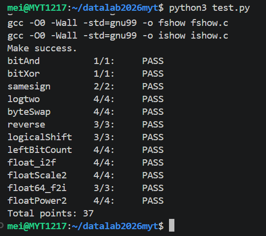

# datalab 报告

姓名：梅雅婷

学号：2025201737

| 总分 | bitAnd | bitXor | samesign | logtwo | byteSwap | reverse | logicalShift | leftBitCount | float_i2f | floatScale2 | float64_f2i | floatPower2 |
| ---- | ------ | ------ | -------- | ------ | -------- | ------- | ------------ | ------------ | --------- | ----------- | ----------- | ----------- |
| 37   | 1/1    | 1/1    | 2/2      | 4/4    | 4/4      | 3/3     | 3/3          | 4/4          | 4/4       | 4/4         | 3/3         | 4/4         |

test 截图：



## 解题报告

### 亮点

1. **logtwo**：合法操作符里没有 `&`、`!`、`+`，用 `>` 的 0/1 结果同时充当答案位和移位数。
2. **leftBitCount**：`~x` 把问题转成前导零计数二分收敛，以及单独处理全 1 时二分只能数到 31 的边界。

### bitAnd / bitXor

德摩根律，bitXor用了 `x^y = (x|y) & ~(x&y)`。其中 `x|y = ~(~x&~y)`，展开即 `~(~x&~y)&~(x&y)`。

```c
 return ~(~x|~y);
 return ~(~x&~y)&~(x&y);
```

### samesign

题目规定 0 既不是正数也不是负数，所以 `(0,0)` 算同号、`(0,非0)` 算异号，先单独判断。剩下的情况只看符号位是否相同：

```c
if(!x){ if(!y) return 1; return 0; }
if(!y){ return 0; }
return !((x>>31)^(y>>31));
```

### logtwo

用折半的方式从高位往低位确定答案的每一位，再依次判断 `v > 0xFFFF`、`> 0xFF`、`> 0xF`、`> 0x3`、`> 0x1`，成立说明位数够，该位记 1 并把 `v` 右移掉已经确定的那一段，`ans` 用 `|` 将不重合的位取或等价于做加法。

```c
int ans = 0, temp;
temp = v > 0xFFFF;
ans = ans | (temp << 4);
v = v >> (temp << 4);
// 再对 0xFF / 0xF / 0x3 / 0x1 各重复一次
```

### byteSwap

先把字节下标换算成位偏移 `nn = n<<3`、`mm = m<<3`，取出两个字节，把原位置清零再交叉移位放回。`n == m` 时两次掩码相同取出的字节也相同，或回去仍是原值不需要特判：

```c
int nn = n<<3, mm = m<<3;
int nbyte = (x>>nn) & 0xFF, mbyte = (x>>mm) & 0xFF;
return (x & ~(0xFF<<nn) & ~(0xFF<<mm)) | (nbyte<<mm) | (mbyte<<nn);
```

### reverse

从 `v` 的最低位开始，顺次接到 `r` 的最低位。用 `unsigned` 保证 `>>` 是逻辑右移，于是 `v` 右移、`r` 左移，正好把位序倒过来：

```c
unsigned r = 0, i = 32;
while (i) { r = (r<<1)|(v&1); v = v>>1; i = i-1; }
```

### logicalShift

`x >> n` 是算术右移高位补符号位，所以要把最高的 n 位清掉。掩码由 `(1<<31)>>n` 得到最高 n+1 位为 1，再 `<<1` 去掉多出来的那一位：

```c
return (x >> n) & ~(((1 << 31) >> n) << 1);
```

### leftBitCount

记 `y = ~x`，则 `x` 左端连续 1 的个数就是 `y` 左端连续的零的个数，问题变成前导零计数，然后用二分：

```c
int y = ~x, n = 0, t;
t = !(y>>16);  n = n + (t<<4);  y = y << (t<<4);
// 再依次用 >>24 / >>28 / >>30 / >>31 重复上面两步，n 加的是 t<<3 / t<<2 / t<<1 / t
n = n + !y;
return n;
```

### float_i2f

1. `x == 0` 单独返回 0，无法归一化。
2. 取符号位 `s`，负数用 `~x+1` 取绝对值。`INT_MIN` 取反加一后仍是 `0x80000000`，按无符号解释为 2^31。
3. 左移直到最高位是 1，记左移次数 `e`，阶码就是 `31 - e + 127`，尾数取 `a>>8` 的高 23 位。
4. 低 8 位 `r` 决定舍入，round-to-even：`r > 0x80` 进位，`r == 0x80` 时尾数最低位是 1 才进位向偶数靠。

```c
if (r > 0x80) f = f + 1;
else if (r == 0x80) { if (f & 1) f = f + 1; }   // 向偶数舍入
if (f == 0x800000) { f = 0; exp = exp + 1; }    // 尾数进位溢出到阶码
```

### floatScale2

阶码全 1 是 NaN 和 Inf，直接返回 `uf`。阶码全 0 是 0 和非规格化数，尾数左移一位即乘 2。左移后溢出到 2^23 位说明已经进入规格化范围，把阶码置 1 再清掉溢出位。

其余是规格化数，阶码加一即乘 2，加到全 1 说明溢出成 Inf，尾数清零。

```c
if (e == 0) {
    f = f << 1;
    if (f & 0x00800000) {
        e = 0x00800000;
        f = f & 0x007FFFFF;
    }
} else {
    e = e + 0x00800000;
    if (e == 0x7F800000) f = 0;
}
```

### float64_f2i

先拆 `uf2`，符号 `s = uf2>>31`，11 位阶码 `e = (uf2>>20)&0x7FF`。`e` 全 1 是 NaN 和 Inf，返回 `0x80000000`；`e == 0` 返回 0；真实阶码 `a = e-1023` 小于 0 说明绝对值不到 1，截断成 0；`a >= 31` 超出 `int` 范围，返回 `0x80000000`。

剩下取整，53 位有效数分成 `h = (1<<20)|(uf2&0xFFFFF)` 和 `l = uf1` 两半，要保留的是 `b = 52-a` 位以上。`b` 可能大于 32，所以分两种情况，负数最后取反加一：

```c
int b = 52 - a;
unsigned h = (1<<20) | (uf2 & 0xFFFFF);
unsigned l = uf1;
unsigned r;
if (b >= 32) r = h >> (b - 32);            // 要取的位全在高 32 位
else         r = (h << (32-b)) | (l >> b); // 跨两个字拼起来
if (s) return ~r + 1;                      // 负数取反加一
return r;
```

### floatPower2

`x > 127` 超出最大规格化数，返回 `0x7F800000` 即 +INF。

`-149 <= x < -126` 落在非规格化区间，尾数位就是 `1 << (x+149)`。

`x < -149` 太小返回 0；其余是规格化，`(x+127) << 23`。

```c
if (x > 127)  return 0x7F800000;
if (x < -149) return 0;
if (x < -126) return 1 << (x+149);
return (x+127) << 23;
```

## 反馈/收获/感悟/总结

好难啊，不过做作业确实能加深课堂理解。

## 参考的重要资料

课程ppt

课程模板仓库：https://github.com/RUCICS2026/datalab2026